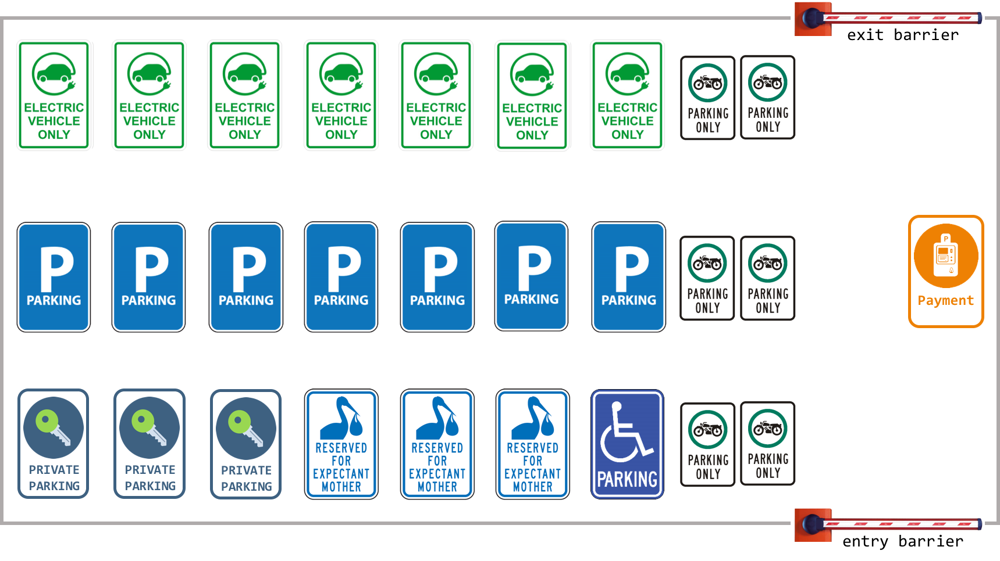

# IoT Smart Parking
This project provides a complete data exchange infrastructure, based on [CoAP](http://coap.technology/), for a parking lot like this:

It manages a great number of activities​,​ ​such​ ​as: 
* Access​ ​control​ ​to​ ​the​ ​structure​ ​(entry/exit​ ​barriers)
* Ticket​ ​managing 
* Granular​ ​access​ ​control​ ​to​ ​parking​ ​lots 
* Payments​ ​(calculation,​ ​payment​ ​methods,​ ​etc.) 
* Secure​ ​access​ ​to​ ​private​ ​parking​ ​lots 
* Backup​ ​for​ ​electrical​ ​parking​ ​events

A simulator has been created for testing purposes, allowing the automated execution of different CoAP clients (vehicles) on the same machine.

#### Additional Resources
And in-depth description of the entire project can be found on the original [Assignment](docs/Final%20Project.pdf) and on my [Final Report](docs/Report.pdf).

## Libraries Used
- [Californium](https://www.eclipse.org/californium/) - The CoAP Framework used for communication

#
_This is the final project of the "Internet of Things" Master's Degree course @University of Parma._
